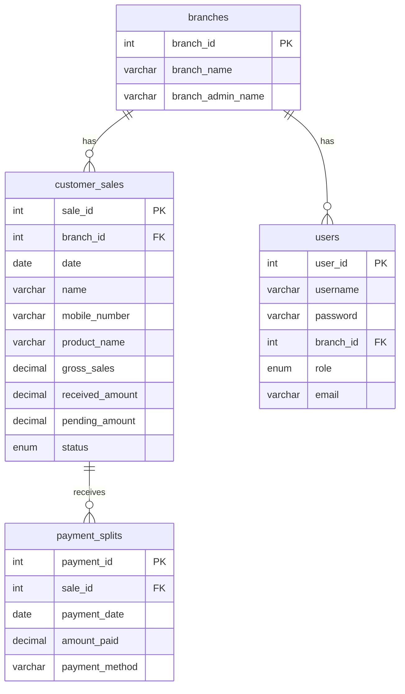

# Sales Intelligence Hub

A branch-based Sales Management System built with **Python, MySQL and Streamlit**, where all financial calculations are handled by the database itself — not by application code.


---

## The Problem

Organisations running sales through multiple branches often track everything manually or in spreadsheets. This causes:

- Duplicate and inconsistent records
- Incorrect payment calculations, especially when customers pay in instalments
- No clarity on how much money is still pending
- No single view of how each branch is performing
- No control over who can see or edit which branch's data

## The Solution

A centralised system where sales and payments are stored in a normalised relational database, financial totals update themselves through SQL triggers, and each user sees only the data their role permits — all surfaced through an interactive Streamlit dashboard.

---

## Features

| Feature | Description |
|---|---|
| Role-based login | Super Admin can add and view data for all branches; Branch Admin only for their own |
| Sales entry | Record branch-wise customer sales with product, gross amount and status |
| Split payments | Multiple payments against a single sale, for customers paying in instalments |
| Automated financials | Triggers and a generated column keep `received_amount` and `pending_amount` correct automatically |
| Financial KPIs | Total sales, total received, total pending, pending collection percentage |
| Branch analytics | Branch-wise sales comparison and branch performance summary |
| Payment analysis | Collection split across Cash / UPI / Card |
| Status tracking | Open vs Close sales monitoring |
| SQL query module | 20 predefined analytical queries executable from the dashboard |

---

## Tech Stack

| Layer | Technology |
|---|---|
| Database | MySQL 8.0 |
| Backend | Python (mysql-connector-python) |
| Frontend | Streamlit |
| Data handling | Pandas |
| Database logic | SQL triggers, generated columns, foreign key constraints |

---

## Database Design

Four normalised tables with full referential integrity.



### Tables

**`branches`** — master list of business branches and their administrators.

**`customer_sales`** — every sale transaction. `pending_amount` is a **generated column** (`gross_sales - received_amount`), so the outstanding balance is always derived, never typed in.

**`users`** — login credentials, assigned branch and role (`Super Admin` / `Admin`), with a unique constraint on email.

**`payment_splits`** — one row per payment, allowing many payments against a single sale.

---

## Automation Logic

Financial figures are never updated by hand. An `AFTER INSERT` trigger on `payment_splits`:

1. Sums all `amount_paid` values for that `sale_id`
2. Writes the total into `customer_sales.received_amount`
3. `pending_amount` then recalculates itself as a generated column

```sql
DELIMITER //
CREATE TRIGGER trg_update_received_amount
AFTER INSERT ON payment_splits
FOR EACH ROW
BEGIN
    UPDATE customer_sales
    SET received_amount = (
        SELECT COALESCE(SUM(amount_paid), 0)
        FROM payment_splits
        WHERE sale_id = NEW.sale_id
    )
    WHERE sale_id = NEW.sale_id;
END //
DELIMITER ;
```

This means the received and pending amounts can never disagree with the payment records, regardless of who enters the data or from which branch.

---

## Project Structure

```
sales-intelligence-hub/
├── app.py                  # Streamlit application (login, dashboard, reports)
├── db_connection.py        # MySQL connection handler
├── requirements.txt
├── sql/
│   ├── schema.sql          # Database and table creation
│   ├── triggers.sql        # Trigger definitions
│   ├── sample_data.sql     # Demo data insertion
│   └── queries.sql         # 20 analytical SQL queries
├── screenshots/
└── README.md
```

---

## Setup

### 1. Clone the repository

```bash
git clone https://github.com/<your-username>/sales-intelligence-hub.git
cd sales-intelligence-hub
```

### 2. Install dependencies

```bash
pip install -r requirements.txt
```

### 3. Set up the database

```bash
mysql -u root -p < sql/schema.sql
mysql -u root -p < sql/triggers.sql
mysql -u root -p < sql/sample_data.sql
```

### 4. Configure credentials

Create a `.streamlit/secrets.toml` file:

```toml
[mysql]
host = "localhost"
user = "root"
password = "your_password"
database = "sales_management_system"
```

> Never commit real credentials. Keep `secrets.toml` in `.gitignore`.

### 5. Run the app

```bash
streamlit run app.py
```

The app opens at `http://localhost:8501`.

---

## Dashboard

| Screen | Preview |
|---|---|
| Login | `screenshots/login.png` |
| KPI summary | `screenshots/kpi.png` |
| Sales report | `screenshots/sales_report.png` |
| Pending payments | `screenshots/pending.png` |

---

## Sample Analytical Queries

**Branch-wise total sales**

```sql
SELECT b.branch_name,
       SUM(cs.gross_sales) AS total_sales
FROM customer_sales cs
JOIN branches b ON cs.branch_id = b.branch_id
GROUP BY b.branch_name
ORDER BY total_sales DESC;
```

**Pending collection percentage**

```sql
SELECT ROUND(SUM(pending_amount) / SUM(gross_sales) * 100, 2) AS pending_percentage
FROM customer_sales;
```

**Payment method-wise collection**

```sql
SELECT payment_method,
       SUM(amount_paid) AS total_collected
FROM payment_splits
GROUP BY payment_method;
```

**Monthly sales summary**

```sql
SELECT YEAR(date) AS year,
       MONTHNAME(date) AS month,
       SUM(gross_sales) AS total_sales
FROM customer_sales
GROUP BY YEAR(date), MONTH(date), MONTHNAME(date)
ORDER BY year, MONTH(date);
```

The complete set of 20 queries — basic retrieval, aggregations, joins and financial tracking — is in [`sql/queries.sql`](sql/queries.sql).

---

## Results

- Structured, normalised relational database with enforced referential integrity
- Zero manual financial calculation — all totals derived by the database
- Accurate split-payment and pending-amount tracking
- Secure authentication with two-tier role-based access control
- Real-time branch-level reporting through a single dashboard

---

## Key Learnings

- Keeping financial logic in the database (triggers and generated columns) rather than in application code guarantees consistency no matter how data is entered
- Generated columns remove a whole class of bugs by making derived values impossible to set incorrectly
- Role-based access control needs to be enforced in the queries themselves, not only hidden in the UI
- Clear schema design makes analytical SQL dramatically simpler to write

---

## Author

**Niveditha**

[LinkedIn](https://linkedin.com/in/<your-profile>) · [GitHub](https://github.com/<your-username>)
